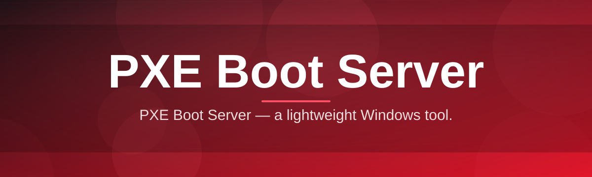
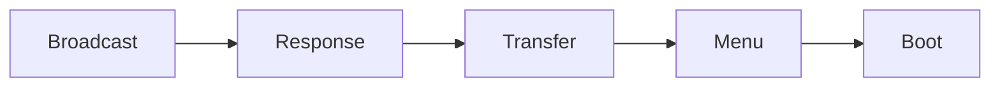

# pxe-boot-server-manager 🚀🖧

  

*One tidy control panel for booting an entire fleet of machines over the network — no USB sticks, no drama.*

  

## 🌐 Overview

`pxe-boot-server-manager` started as a weekend itch: I was reimaging a lab of thirty machines by hand, one bootable USB at a time, and by machine number twelve I promised myself I'd never do that again. What began as a scrappy script to spin up a DHCP proxy and TFTP root became a full desktop application — one that treats PXE (Preboot Execution Environment) booting like a first-class citizen instead of an arcane ritual buried in router config pages and half-documented `pxelinux.cfg` files.

At its heart, this is a **PXE boot server manager for Windows** that stitches together the three pillars of network booting — DHCP options/proxy DHCP, TFTP file serving, and boot menu orchestration (BIOS + UEFI, iPXE included) — into a single window with sane defaults. You point it at a folder of images, flip a switch, and machines on your LAN start seeing your boot menu the moment they hit F12. No dependencies to hunt down, no separate DHCP daemon to babysit, no editing raw config text at 1am.

It's built for the people who actually live this workflow: system administrators re-imaging classrooms and offices, homelab tinkerers standing up diskless nodes, hardware recyclers wiping and reloading donated machines, and hobbyists experimenting with network installs of Linux distributions or Windows deployment images. If you've ever muttered "there has to be a better way to PXE boot this" — this is that better way.

---

## 🔥 What's Under the Hood

> [!NOTE]
> Every capability below ships in the same executable — there's no "pro tier" hiding behind a paywall. What you download is the whole toolbox.

- **Proxy DHCP Mode** — coexists peacefully with your existing router or DHCP server by only answering PXE-specific requests (option 60/66/67), so you never have to fight your network team for control of address leases.

- **Integrated TFTP Engine** — a hardened, high-throughput TFTP server built in, tuned for large boot images and flaky client NICs, with automatic block-size negotiation.

- **UEFI & Legacy BIOS Boot Paths** — serves the right bootloader (`bootx64.efi`, `pxelinux.0`, `wimboot`, or a custom iPXE chain) depending on client architecture, detected automatically from the DHCP request.

- **Visual Boot Menu Designer** — drag, drop, and reorder boot entries as if you were arranging desktop icons, with live preview of what the client will actually see on screen.

- **Multi-Image Library** — organize ISOs, WIM files, and kernel/initrd pairs into named profiles you can toggle on or off per deployment session.

- **Live Client Console** — a real-time table of every device currently in the boot handshake: MAC address, requested architecture, assigned IP, and current stage (discover → offer → TFTP transfer → handoff).

- **Session Logging & Export** — every boot attempt is timestamped and exportable to CSV, handy for audits or for figuring out which machine in the closet keeps failing.

- **Network Interface Binding** — explicitly choose which NIC the service listens on, essential for machines with multiple adapters or VPNs running in the background.

---

## ⚡ Getting Rolling

1. Hit the download button above and grab the latest build from the landing page.

2. Launch the app — it's a single executable, so there's nothing to unpack or configure ahead of time.

3. Point it at your boot image folder, pick Proxy DHCP or Standalone DHCP mode, and select your network adapter.

4. Click **Start Server**, then power on (or PXE-boot) a client machine and watch it appear in the Live Client Console.

> [!TIP]
> Run a single test machine first before flipping the switch on an entire lab. Confirming one client boots cleanly saves a lot of head-scratching later.

---

## 🖥️ System Requirements

| Component | Requirement |
|---|---|
| OS | Windows 10 or Windows 11 (64-bit) |
| Dependencies | None — fully standalone, no runtime installs required |
| Network | Wired Ethernet adapter strongly recommended for the DHCP/TFTP interface |
| Privileges | Administrator rights (needed to bind low-level network ports) |
| Disk | ~150 MB free for the app plus space for your boot images |

> [!IMPORTANT]
> Ports 67, 68, and 69 must be free on the chosen adapter. If another DHCP or TFTP service is already bound to them, the manager will tell you exactly which process is holding the port.

---

## 🛠️ How It Works

The flow is deliberately linear — a client machine broadcasts, the server answers, and a boot image gets handed off:

1. **Client Broadcast** — a machine set to network boot sends a DHCP discover packet tagged with PXE options.

2. **Server Response** — `pxe-boot-server-manager` replies with boot server info and the path to the correct bootloader for that architecture.

3. **TFTP Transfer** — the client requests the bootloader and boot menu configuration over TFTP, served directly from your local image library.

4. **Menu Selection** — the client renders your custom boot menu, and the chosen image is streamed and handed off for execution.

---

## 🧩 Troubleshooting

<strong>My client machine never shows the boot menu — it just times out.</strong>

Check that your NIC's driver actually supports PXE and that "Network Boot" is enabled and prioritized in the client's firmware/BIOS boot order.

<strong>The server won't start and complains about port 67 or 69.</strong>

Another DHCP or TFTP service (often a VPN client, virtualization suite, or router software) is already bound to that port. Stop it, or switch the manager into Proxy DHCP mode if a DHCP server must stay running elsewhere.

<strong>UEFI machines boot fine but legacy BIOS machines fail.</strong>

Confirm both `bootx64.efi` and a legacy loader like `pxelinux.0` exist in your image profile — the manager needs both paths available to serve mixed hardware fleets.

<strong>The transfer starts but stalls partway through a large WIM file.</strong>

This is almost always a TFTP block-size mismatch with older firmware. Lower the negotiated block size in Settings → Network → TFTP Tuning and retry.

<strong>Clients on a different VLAN can't see the server at all.</strong>

PXE broadcasts don't cross VLAN boundaries by default. You'll need a DHCP relay agent (`ip helper-address` on most switches/routers) pointed at the manager's IP.

---

## 🎨 UI / UX Details

The interface leans on a dark, high-contrast theme by default because most of us are staring at this thing in a server room, not a sunlit café — a light theme is available in Settings for daytime desks.

| Shortcut | Action |
|---|---|
| `Ctrl + S` | Start / Stop the boot server |
| `Ctrl + N` | Add a new boot image profile |
| `Ctrl + L` | Jump to the Live Client Console |
| `Ctrl + E` | Export session log to CSV |
| `F5` | Refresh network adapter list |

> [!TIP]
> The status bar icon isn't decorative — green means actively serving, amber means listening but idle, and red means a bind conflict needs attention.

Settings persist between sessions in a local config file, so your image library, adapter choice, and theme survive updates and reboots without re-setup.

---

## 🤝 Contributing & Community

  

This project grew from a personal frustration, but it's kept alive by everyone who files a sharp bug report or suggests a feature that scratches their own itch. Whether you're fixing a typo in this README or adding support for a new bootloader chain, contributions are genuinely welcome.

> Open an issue describing what you tried, what you expected, and what actually happened — logs from the Live Client Console are gold for debugging boot handshake problems.

- Star the repo if this saved you a night of manual USB imaging.

- Open a discussion if you're not sure whether something's a bug or a "you're holding it wrong" situation.

- Pull requests for new image format support or menu themes are especially appreciated.

---

## 📜 License

Released under the [MIT License](LICENSE), 2026. Use it, fork it, ship it inside your own internal tooling — just keep the license notice intact.

---

## ⚠️ Disclaimer

This software touches low-level network protocols (DHCP, TFTP) that can interfere with existing infrastructure if misconfigured. Always test in an isolated segment or a single machine before deploying across a production network. The maintainers provide this tool as-is, with no warranty, and are not responsible for network outages, misconfigured DHCP scopes, or that one printer that mysteriously stops working every time PXE traffic is on the wire.

> [!WARNING]
> Running two DHCP servers on the same subnet without Proxy mode enabled can cause address conflicts across your entire network, not just the machines you intend to boot. When in doubt, use Proxy DHCP.

